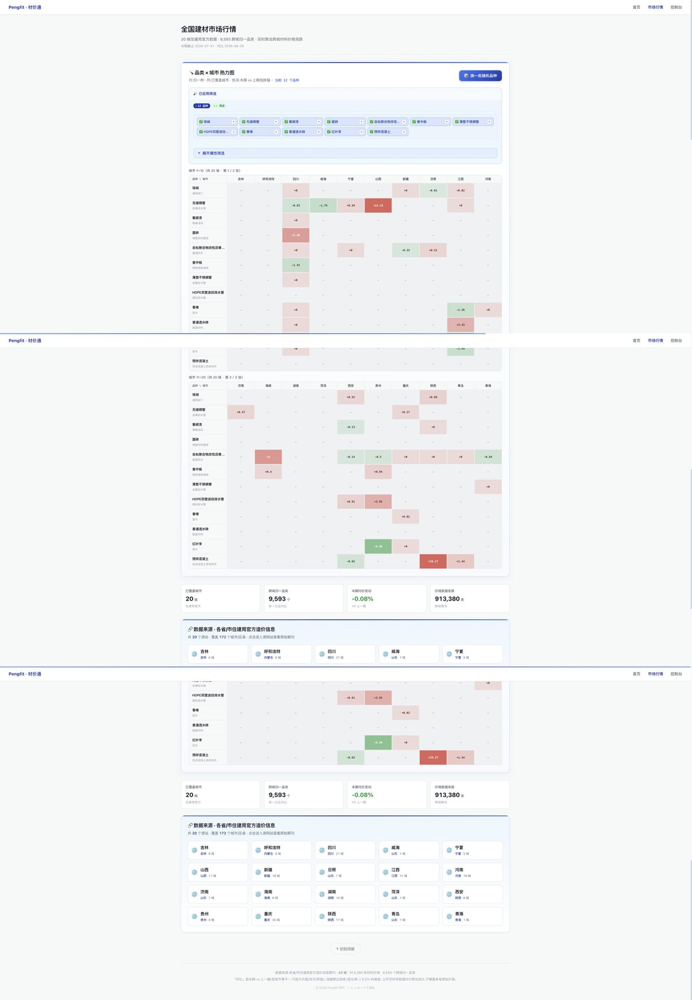

# 材价通 / cjt-skills

> 开源工程造价数据基础设施 — 从政府公开期刊到跨城统一查询的全链路工具链。

20 个省/市住建局官方造价信息期刊 · 凌晨自动采集 · 17 城 ETL 三段式清洗 · 9,931 个跨城归一品种 · FastAPI + Vue3 公开 Dashboard。

## ✨ 特性

| 维度 | 说明 |
|------|------|
| 📡 **数据采集** | 20 个住建局官方期刊自动抓取,断点续传 + SIGINT 安全中断 |
| ⚙️ **ETL 三段式** | ODS → DWD → DWS,DB 5 段式 + AI 攒批(走 Dify workflow) |
| 🌐 **跨城归一** | L1~L4 四层规范化,9,931 个品种统一口径,公开 Dashboard 可匿名查询 |
| 🧹 **attr 脏数据治本** | 三段式闭环(净化上游 + 封堵中游 + 修正下游),脏率 32.66% → 0% |
| 🏛️ **GB 章节 4 层分类** | 8 L1 / 42 L2 / 145 L3,按 GB 50854-2013 / GB/T 50856-2024 / GB 50857-2013 / GB 50858-2013 重建 |
| 📊 **公开 Dashboard** | FastAPI + Vue3 + ECharts 6.x,`/market` 跨城热力图 / 涨跌幅 / 趋势,零登录访问 |
| 🔌 **声明式 skill 注册** | 新增城市只需写 `skill.yml` + `config.yml`,Dashboard 自动发现 |

## 🏗️ 架构

```
原始数据源 (20 个政府工程造价网站)
       ↓
[城市]-price skill     (同步 → ods_material_{city}_price)
       ↓
gov-price-etl          (清洗 → dwd_{city}_price)
       ↓
gov-price-etl/sync_dws (聚合同步 → dws_{city}_price)
       ↓
gov-price-normalization (标准化 → norm_{city}_price)   ← Dashboard 默认数据源
       ↓
gov-price-dashboard    (可视化 · /home /market)
```

## 📸 Demo

完整全页截图（包括 Hero + KPI 卡片 + 城市×品种热力图 + 数据来源模块 + 页脚），运行时单次截图超过 25M 像素限制，分 3 段拼接 + 缩放到 1200 宽。



[`/market` 公开访问](https://pengfit.cn/market) — 跨城归一热力图、涨跌幅监控、20 个住建局源站链接直达。

## 📁 项目结构

```
cjt-skills/
├── gov-price-etl/              # ETL 公共层(v0.10)
├── gov-price-normalization/    # 标准化层(v0.2,L1 attr 净化)
├── gov-price-dashboard/        # 材价通 Dashboard(FastAPI + Vue3)
├── gov-price-etl/dify_workflows/  # Dify workflow 配置
│
├── [城市]-price/               # 17 个城市采集 skill
│   ├── chongqing-price/        # 35 区县(county 模式)
│   ├── xian-price/             # 6 区县(county 模式)
│   ├── xinjiang-price/         # 16 区县(county 模式)
│   ├── beijing-price/          # ...
│   └── ...                     # 其余 14 城按期期刊(period 模式)
│
└── scripts/                    # 运维脚本(进度修复/批量操作)
```

## 🚀 快速开始

```bash
# 1. 安装 Elasticsearch 7.x + Python 3.10+ (建议用 Docker)
docker run -d --name es -p 9200:9200 -e "discovery.type=single-node" \
  elasticsearch:7.17.0

# 2. 安装 Python 依赖
pip install elasticsearch requests beautifulsoup4 pypdf pdfplumber pyyaml

# 3. 启动 Dashboard
cd gov-price-dashboard
./start.sh
# 前端:http://localhost:5300  ·  API:http://localhost:5200

# 4. 同步单个城市(如西安)
cd ../xian-price
./run.sh sync

# 5. 全量 ETL(ODS → DWD → DWS)
cd ../gov-price-etl
./cli/etl.py --city xian             # 单城市
./cli/etl.py --incremental --since 2026-05-01  # 增量

# 6. NORM 重建(DWS → NORM,供 Dashboard 查)
cd ../gov-price-normalization
python3 cli/build_norm_index.py --city xian
```

详细部署文档: [gov-price-dashboard/deploy.sh](./gov-price-dashboard/deploy.sh) + 各 skill 的 `SKILL.md`。

## 📊 数据层

| 层次 | 模块 | 索引示例 | 关键字段 |
|------|------|---------|---------|
| **ODS** | 城市采集 | `ods_material_xian_price` | 原始字段 + `period_start/end/days` + `province/city/county` |
| **DWD** | ETL 清洗 | `dwd_xian_price` | + `category_v2_source` + `attr` (nested) |
| **DWS** | ETL 聚合 | `dws_xian_price` | + `attr_source` + `normalized_breed` |
| **NORM** | 标准化 | `norm_xian_price` | + `period_norm` / `unit_norm` / `price_norm` / `attr_norm` / `_norm.status` |

**数据源优先级**:Dashboard 默认查 NORM,缺失自动降级 DWS(`DASHBOARD_DATA_LAYER=dws` 可强制回退)。

## 🧹 attr 脏数据治本闭环

| 层 | 位置 | 作用 |
|----|------|------|
| **L1 NORM 净化** (治本) | `gov-price-normalization/layers/fields.py::sanitize_attr()` | 删 9 大脏模式 + L3 类目白名单 + HARD_REJECT 护栏 |
| **L2 ETL 封堵** (治标) | `gov-price-etl/transform/attr_utils.py` + `parse_spec/base.py` | volume/brand 黑名单 + `_CATCH_ALL_FORBIDDEN_KEYS` + 电缆命名标准化 |
| **L3 类目修正** | `breed_canonical.db` | 295 条 PVC-U/PPR/PE/PP 排水管错分类修正 |

详见 [gov-price-normalization/SKILL.md](./gov-price-normalization/SKILL.md) 与 [MEMORY.md](./MEMORY.md) 的「attr 脏数据治本闭环」章节。

## 🛠️ 已支持城市

| 进度模式 | 城市 |
|----------|------|
| **county** (按区县) | 西安(6) · 重庆(35) · 新疆(16) |
| **period** (按期期刊) | 海南 · 河南 · 菏泽 · 呼和浩特 · 湖南 · 江西 · 吉林 · 济南 · 宁夏 · 青岛 · 青海 · 陕西 · 山西 · 威海 · 贵州 |
| **catalogue** (按分类目录) | 日照 · 四川 |

完整列表 + 各城市采集细节:对应 `*-price/SKILL.md`。

## 🤝 贡献

PR 永远欢迎。常见贡献方向:

- **新增城市**:参照 [chongqing-price/SKILL.md](./chongqing-price/SKILL.md) 写 `skill.yml` + `config.yml` + `commands/sync.py`
- **attr 净化规则**:在 [gov-price-normalization/data/attr_filters.json](./gov-price-normalization/data/attr_filters.json) 加数据驱动规则
- **GB 分类体系扩充**:编辑 `gov-price-etl/data/category_v3.json` + `breed_category_rules.db`
- **Bug 报告**:附 ES 索引名 + 复现命令,提交到 issue tracker

## 📄 License

[MIT License](./LICENSE)

## 🙏 致谢

- **数据来源**:20 个省/市住建局官方造价信息期刊
- **AI 编排**:[Dify](https://dify.ai) workflow
- **多模型协作**:[OpenClaw](https://openclaw.ai)
- **可视化**:[Apache ECharts](https://echarts.apache.org)