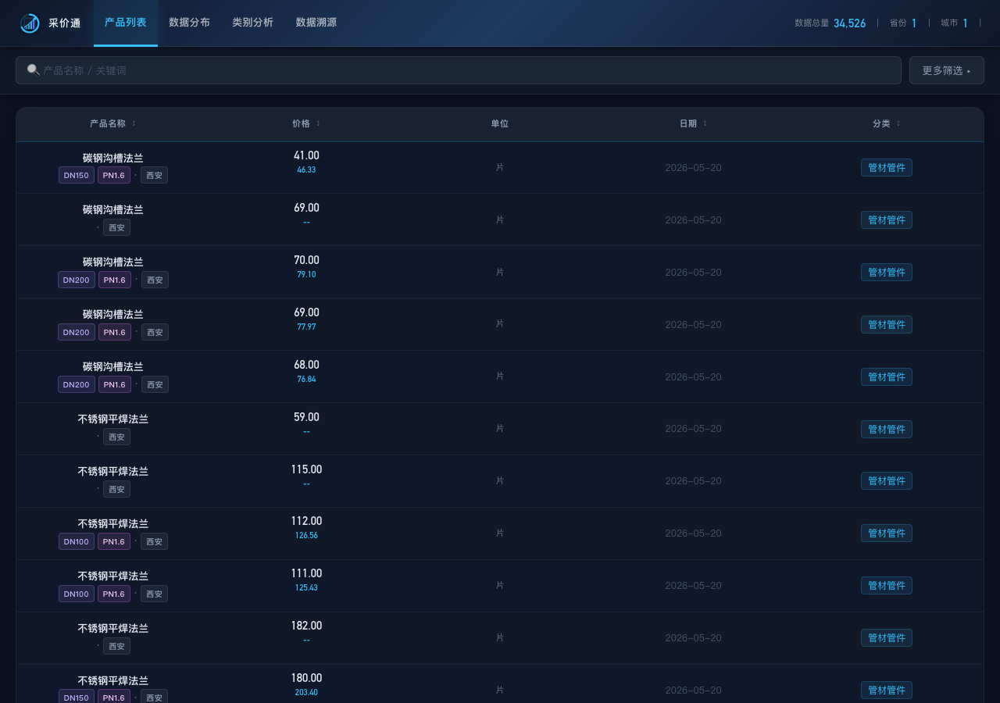
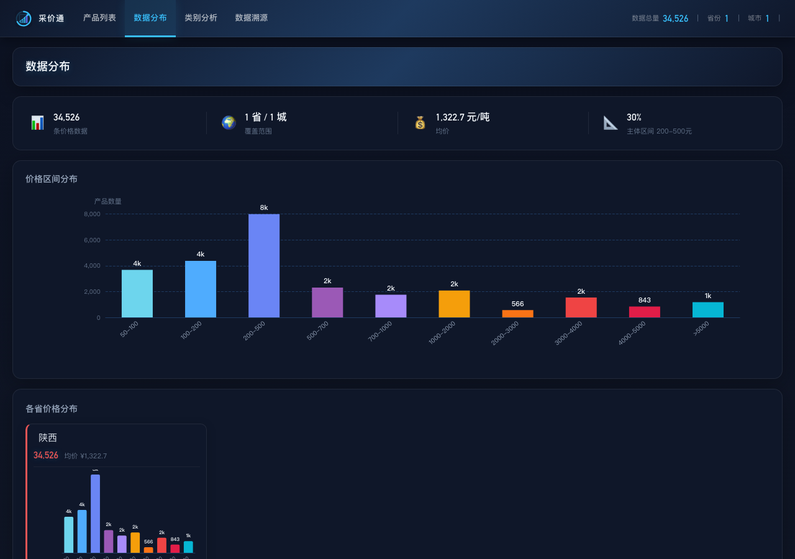
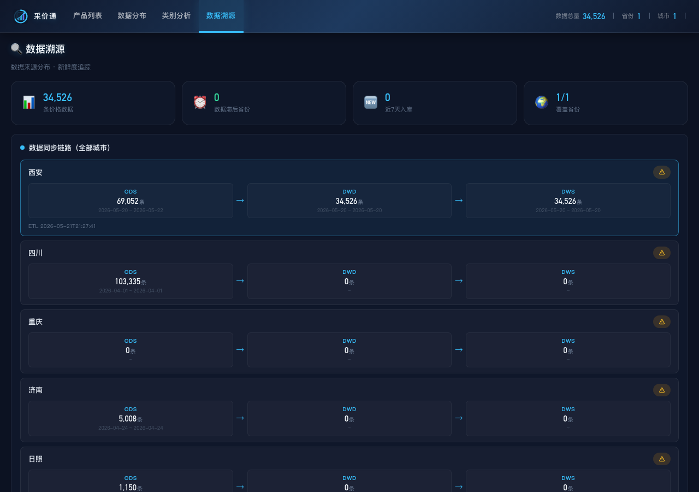

# 政府材料价格看板

政务数据材料价格查询与可视化平台，基于 Elasticsearch 数据源，支持多维度筛选、价格趋势分析、数据溯源追踪。

> **在线访问**：http://localhost:5300

## 界面预览

### 产品列表 — 多维筛选搜索



支持关键词搜索、省市县三级联动、价格区间、33 个分类、29 种规格字段（管径/壁厚/材质/电压…）精确筛选。

### 数据分布 — 来源分布与新鲜度



展示各省份数据量、TOP 来源城市（5 城市）、新鲜度追踪（7 天未更新标红）。

### 数据溯源 — 30 天入库趋势



近 30 天每日入库量柱状图 + 近 7 天 vs 前 7 天周对比增量，ODS 抓取进度实时监控（5 城市）。

## 技术栈

| 层级 | 技术 |
|------|------|
| 后端 | Python 3 + FastAPI + Elasticsearch |
| 前端 | Vue 3 + Vite + ECharts |
| 数据源 | ES 本地（`http://localhost:59200`）|

## 快速启动

```bash
cd skills/gov-price-dashboard
./start.sh          # 一键启动
```

访问：
- **前台**：http://localhost:5300
- **API**：http://localhost:5200
- **API 文档**：http://localhost:5200/docs

## 停止服务

```bash
kill $(lsof -ti :5300)   # 前台
kill $(lsof -ti :5200)   # API
```

## 数据架构

```
ods_material_{city}_price   ← 各城市原始数据（XML/Excel 解析入库）
       ↓
gov-price-etl (etl.py)     ← ODS → DWD 清洗，品种/规格标准化
       ↓
dwd_{city}_price           ← attr 字段展开（29 个细分规格字段）
       ↓
sync_dws.py                ← DWD → DWS 聚合，生成统计字段
       ↓
dws_{city}_price           ← API 直接查询层

API 层（FastAPI）          ← http://localhost:5200
       ↓
前台（Vue 3）              ← http://localhost:5300
```

## 项目结构

```
gov-price-dashboard/
├── README.md
├── SKILL.md                 # 详细文档（启动/索引/字段/API）
├── start.sh                 # 一键启动脚本
│
├── api/
│   ├── main.py              # FastAPI 后端（18 个端点）
│   └── routes/
│       └── provenance.py   # 数据溯源 API（抓取进度/新鲜度）
│
└── frontend/
    └── src/
        ├── App.vue          # 主应用 + 路由
        ├── style.css        # 全局样式
        └── components/
            ├── CategoryView.vue          # 分类视图
            ├── DataProvenanceView.vue   # 数据溯源
            ├── DistributionChart.vue    # 数据分布
            ├── CustomSelect.vue         # 自定义下拉筛选
            └── ErrorBoundary.vue        # 错误边界
```

## 前台功能区

| 标签页 | 说明 |
|--------|------|
| **产品列表** | 多维筛选搜索，品种/规格/价格/attr 标签表格 |
| **数据分布** | 省份/城市/分类数据量分布图，7 天未更新标红 |
| **类别分析** | 分类下钻，含品种列表和规格价格明细 |
| **数据溯源** | 来源分布、省份新鲜度、30天入库趋势、抓取进度监控 |

### 产品列表 — 筛选维度

- **关键词搜索**：品种名模糊匹配，短词（≤2字符）自动 fuzzy 容错
- **省份 / 城市 / 区县**：三级下拉联动
- **价格区间**：`price` / 含税价范围
- **分类**：33 个分类（管材管件/钢材/水泥/石材/电气材料…）
- **单位**：件/米/吨/立方米等

### attr 规格字段（29 个）

| 字段 | 说明 | 示例 |
|------|------|------|
| `thickness` | 厚度 | `2mm`, `4.5mm` |
| `length` | 长度 | `1200mm` |
| `width` | 宽度 | `400mm` |
| `height` | 高度 | `600mm` |
| `height_range` | 高度范围 | `H100~H250` |
| `diameter` | 管径 | `DN125~250`, `Φ700` |
| `material` | 材质 | `PVC`, `PE`, `铸铁` |
| `grade` | 牌号/等级 | `C30`, `Q235B`, `P.O42.5R` |
| `color` | 颜色 | `白色`, `灰色` |
| `voltage` | 电压 | `220V`, `380V` |
| `current` | 电流 | `16A`, `32A` |
| `cross_section` | 电缆截面 | `2.5mm²`, `240mm²` |
| `asphalt_type` | 沥青类型 | `AC-13`, `SBSAC-13` |
| `cement_content` | 水泥含量 | `C30`, `C40` |
| `channels` | 通道数 | `2通道` |
| `doors` | 门数 | `单开门`, `双开门` |
| `cores` | 芯数 | `3芯`, `4芯` |
| `drain_type` | 排水类型 | `下出水`, `地排水` |
| `installation_type` | 安装类型 | `台下盆`, `立柱盆` |
| `inlet_type` | 进水类型 | `后进水`, `侧进水` |
| `fiber_core` | 光纤芯数 | `12芯`, `24芯` |
| `length_range` | 长度范围 | `3m~5m` |
| `media` | 介质 | `水`, `气` |
| `range` | 量程 | `0~100MPa` |
| `output` | 功率 | `50W`, `100W` |
| `cable_length` | 线缆长度 | `5m`, `10m` |
| `temp_range` | 温度范围 | `-20℃~70℃` |
| `humidity_range` | 湿度范围 | `0~95%RH` |
| `pressure` | 压力等级 | `PN16`, `PN25` |

## 支持城市

| 城市 | 状态 | 抓取类型 |
|------|------|---------|
| 西安 | ✅ 完成 | 6 区县（37 品种） |
| 四川 | ✅ 完成 | 21 地市 |
| 重庆 | ✅ 完成 | 41 区县 |
| 济南 | ✅ 完成 | 41 分类目录 |
| 日照 | ✅ 完成 | 3 类别（建设工程材料/园林绿化/区县工程） |

## API 接口

| 方法 | 路径 | 说明 |
|------|------|------|
| `GET` | `/api/search` | 价格搜索（分页/筛选/sort） |
| `GET` | `/api/stats/overview` | 全局概览（总量/省份/城市/分类分布） |
| `GET` | `/api/stats/provenance` | 数据溯源（新鲜度/趋势/来源） |
| `GET` | `/api/stats/scrape-progress` | 单城市抓取进度（区县/类别详情） |
| `GET` | `/api/stats/scrape-progress-all` | 全部城市抓取进度汇总 |

### 搜索 API 详细参数

```
GET /api/search
  ?keyword=钢管          # 关键词
  ?province=陕西         # 省份
  ?city=西安             # 城市
  ?county=雁塔区         # 区县
  ?category=管材管件     # 分类
  ?unit=米               # 单位
  ?price_min=10          # 最低价
  ?price_max=100         # 最高价
  ?page=1                # 页码（默认1）
  ?page_size=20          # 每页条数（默认20，最大100）
```

## ES 索引

| 城市 | ODS 层 | DWD 层 | DWS 层 |
|------|--------|--------|--------|
| 西安 | `ods_material_xian_price` | `dwd_xian_price` | `dws_xian_price` |
| 四川 | `ods_material_sichuan_price` | `dwd_sichuan_price` | `dws_sichuan_price` |
| 重庆 | `ods_material_chongqing_price` | `dwd_chongqing_price` | `dws_chongqing_price` |
| 济南 | `ods_material_jinan_price` | `dwd_jinan_price` | `dws_jinan_price` |
| 日照 | `ods_material_rizhao_price` | `dwd_rizhao_price` | `dws_rizhao_price` |

## 相关项目

- **gov-price-etl**：`/skills/gov-price-etl/` — ODS → DWD 数据清洗与 ETL
- **各城市同步脚本**：
  - `xian-material-price` — 西安
  - `sichuan-price` — 四川
  - `chongqing-price` — 重庆
  - `jinan-price` — 济南
  - `rizhao-price` — 日照